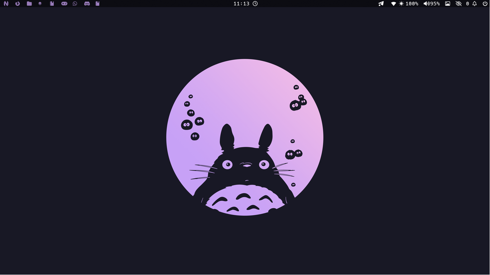
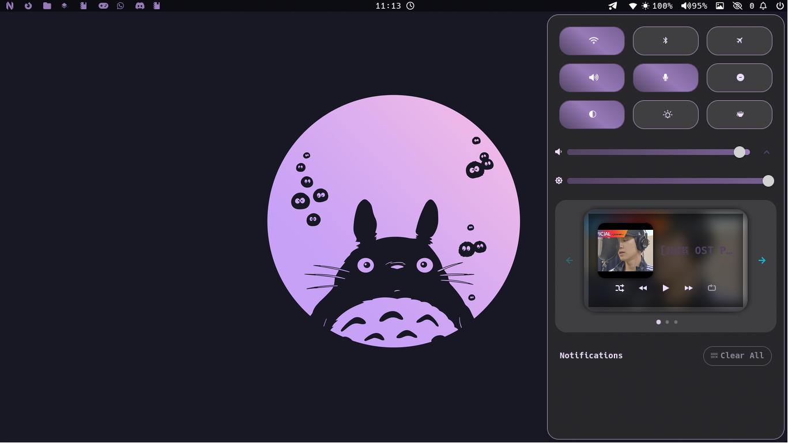
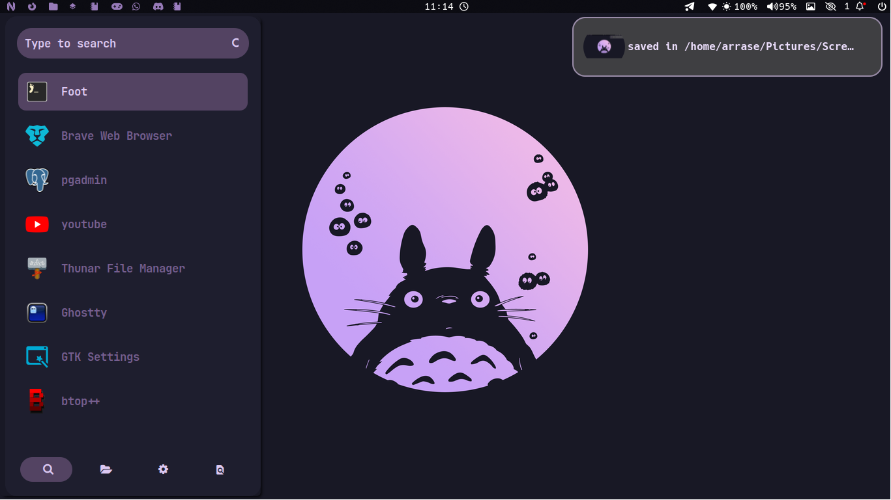
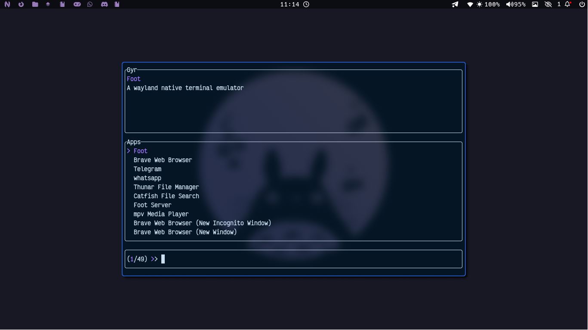
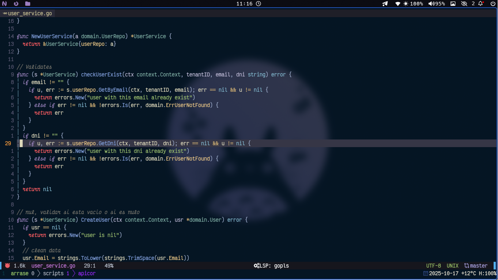

<div align="center">

# 🖥️ My mangowc Setup


A minimal setup for **openSUSE Tumbleweed** using Mangowc 🧊  
Includes launchers, notifications, editor  — fully configured!

---
### 🎥 Demo Video


### 🏠 HOME


### 🪟 Swaync


### 🚀 Alternative Launcher


### 🧭 Launcher


### ✏️ Editor


---

## ⚙️ Installation (only openSUSE Tumbleweed)

> 🧩 On other distros, copy `.config` manually to your home folder.

### 📦 Using Curl
```bash
curl -O https://raw.githubusercontent.com/arrase21/dot-files/main/install-configs.sh
chmod +x install-configs.sh
sudo ./install
```
---
💚 Made for openSUSE Tumbleweed users
with ❤️ by arrase21

💫 Thanks to [DreamMaoMao](https://github.com/DreamMaoMao/mangowc)  
for their amazing work on **mangowc**!

---

## ⚠️ Errors / Workflow Notes

> This is my workflow. There might be errors, so please investigate any issues and fix them.  
> The package names may change from time to time, so check if there's anything wrong with the script.  
> I’ll try to keep it updated whenever I can.

</div>
